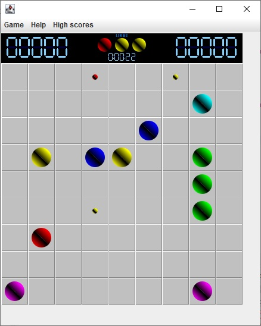

# Lines-98
Lines-98 game written originally using Java Applet and then converted to Java Swing back in 2012. 
It supports 3 difference types of game where you get scores if you move balls into one of the following shapes
<ul>
  <li>Line Game: Move balls into a line (at lease 5 balls in a line)</li>
  <li>Square Game: Move balls to a square (4 balls)</li>
  <li>Block Game: Move balls to a block (7 neighbor balls)</li>
</ul>

Something need to be improved:
<ol>
  <li>Make the ball look better</li>
  <li>Improve concurrent processing in order make movement smoother</li>
  <li>Refactor source code since it was developed long time ago</li>
  <li>Convert to an Android game</li>
<ol>
